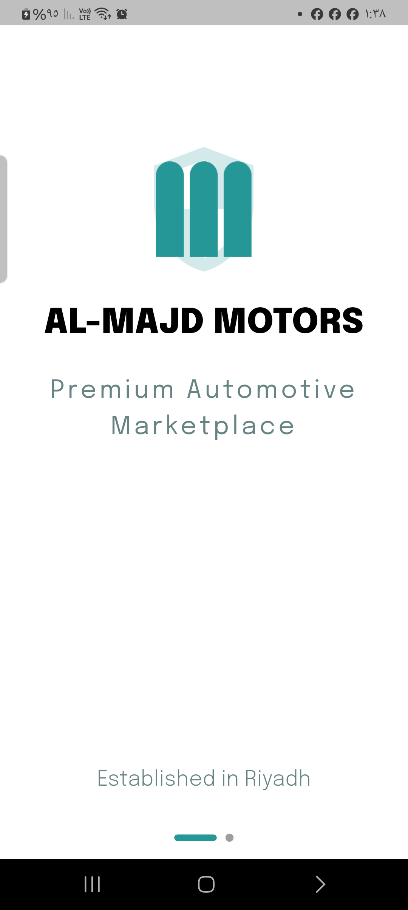
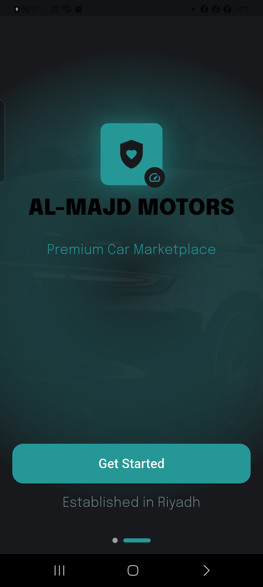
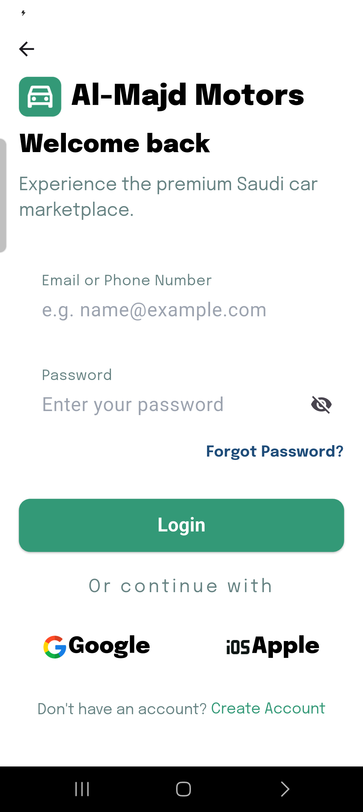
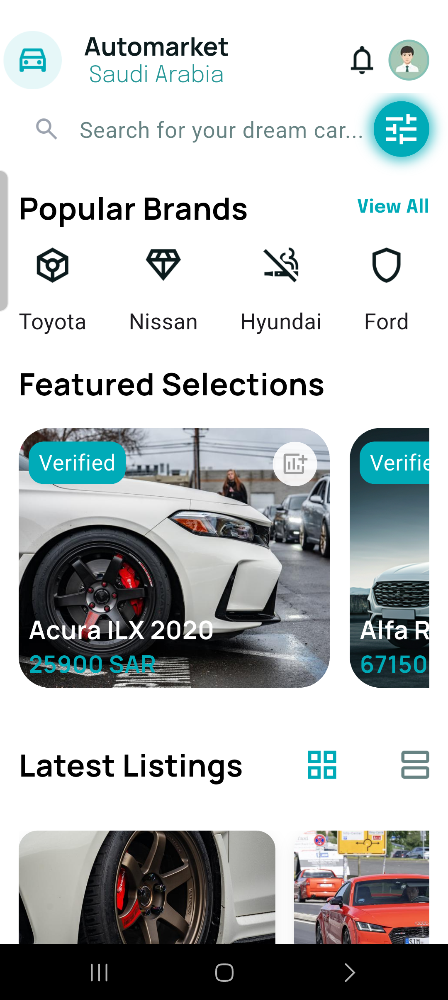
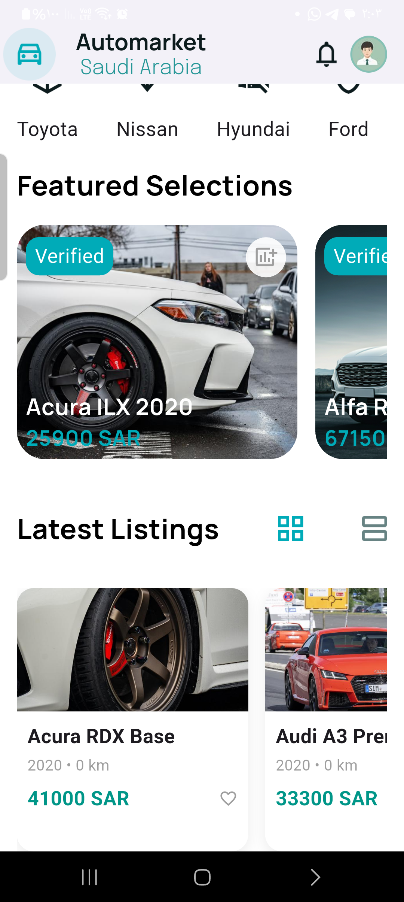
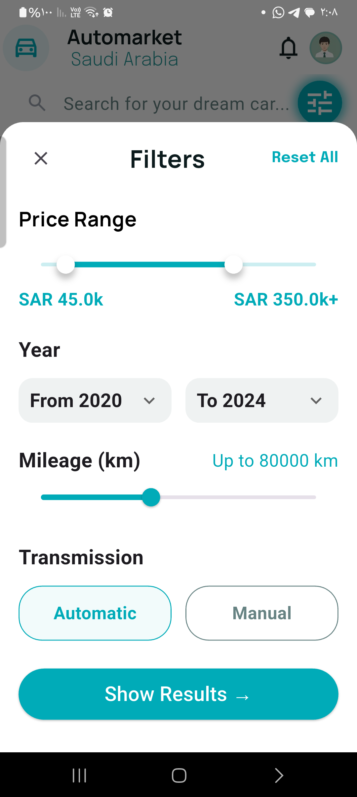
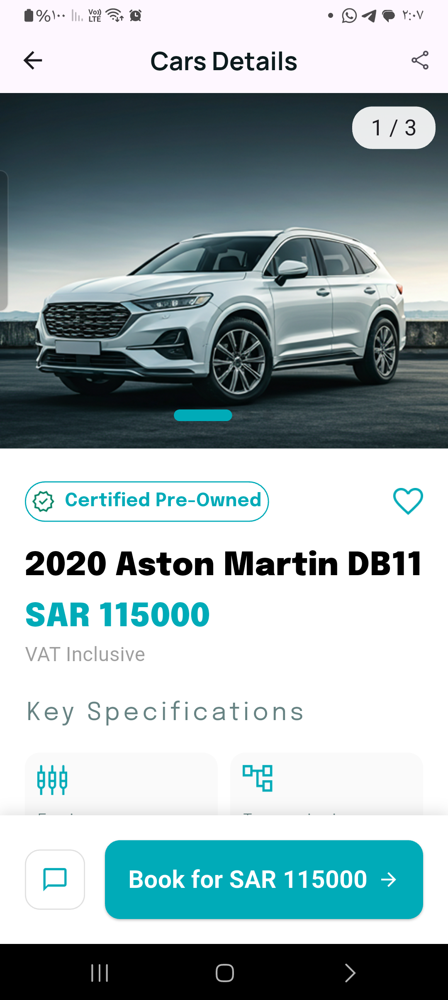
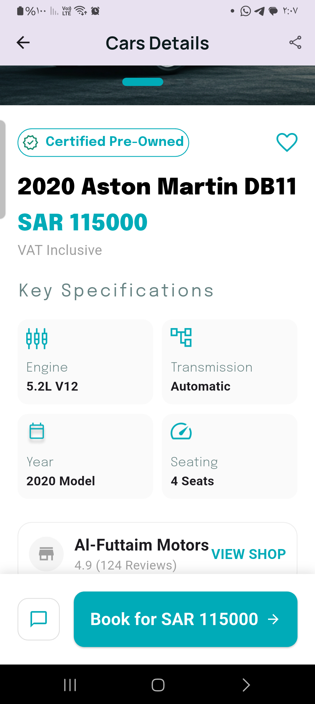
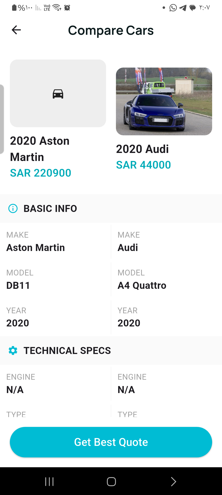
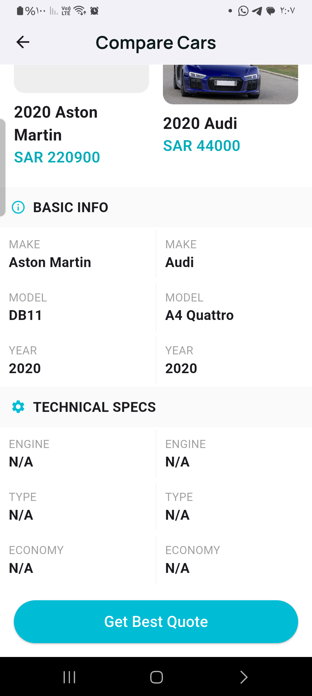

# 📝 Cars E-Commerce App

A modern, high-performance automotive e-commerce mobile application built with **Flutter**. The app provides a seamless experience for browsing, comparing, and discovering car specifications using real-time APIs. It follows Clean Architecture and robust state management (Bloc).

---

## 📸 Screenshots

### 🌟 App Flow & Authentication
| Onboarding 1 | Onboarding 2 | Login Screen | Register Screen |
| :---: | :---: | :---: | :---: |
|  |  |  |  |

### 🚗 Home & Search
| Home 1 | Home 2 | Search |
| :---: | :---: | :---: |
|  |  |  |

### 🔍 Details & Comparison
| Details 1 | Details 2 | Compare 1 | Compare 2 |
| :---: | :---: | :---: | :---: |
|  |  |  |  |

> **Note:** Ensure the `screenshots` folder is in the **root directory** (same level as `pubspec.yaml`), NOT inside `lib`.

---

## ✨ Key Features

### 🆕 User Experience (Onboarding & Auth)
* **Intuitive Onboarding:** A two-step immersive onboarding flow to introduce key app features.
* **Secure Authentication:** Complete Login and Registration screens with validation.

### 🚀 Performance & UI
* **Smart Image Caching:** Smooth UI performance using `cached_network_image`.
* **Responsive Design:** Fully adaptive UI for all screen sizes using `flutter_screenutil`.
* **Loading Shimmers:** Elegant loading states with the `shimmer` package.

### 🚘 Car Browsing & Comparison
* **Dynamic Car Listing:** Filtered and shuffled car lists with unique makes.
* **Smart Comparison System:** Select two cars to compare their technical specifications side-by-side.

---

## 🛠 Tech Stack & Architecture
This project follows **Clean Architecture** for scalability and maintainability.

* **State Management:** `flutter_bloc`
* **Navigation:** `auto_route`
* **UI/Responsive:** `flutter_screenutil`, `shimmer`, `cached_network_image`
* **Dependency Injection:** `get_it`, `injectable`

---

## 🚀 How to Run the Project
1. **Clone & Install:** `flutter pub get`
2. **Generate Files:** `flutter pub run build_runner build --delete-conflicting-outputs`
3. **Run:** `flutter run`

---

## 👤 Author
**Mohamed Elqadii**
* Senior Flutter Developer
